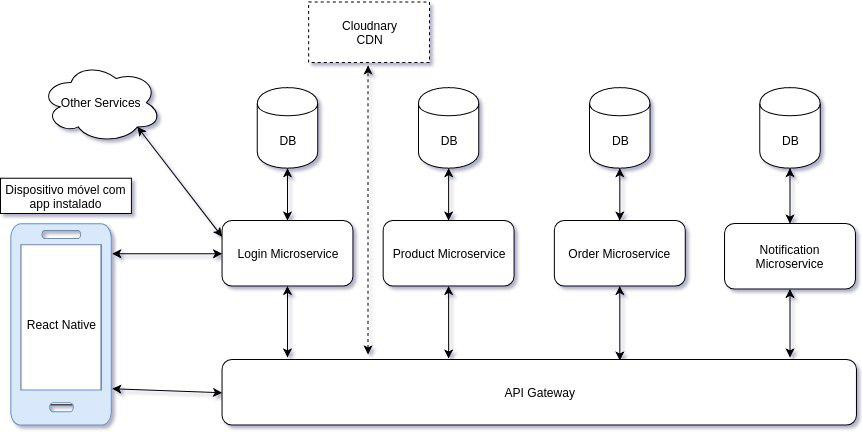
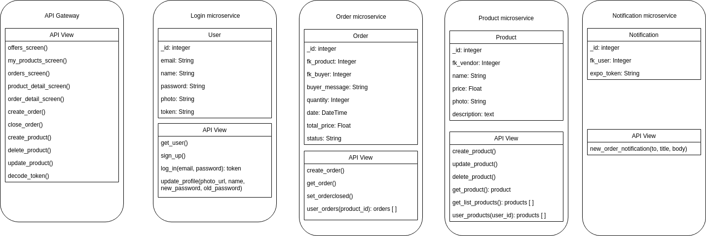
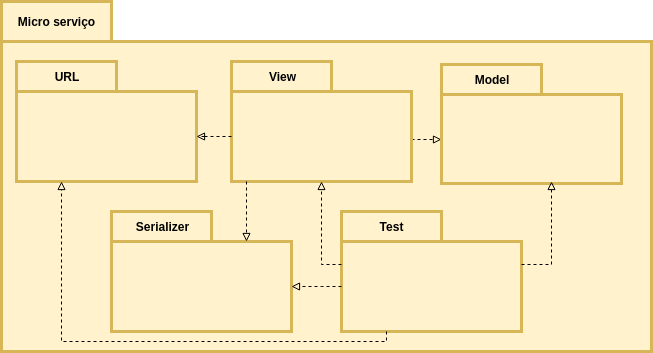
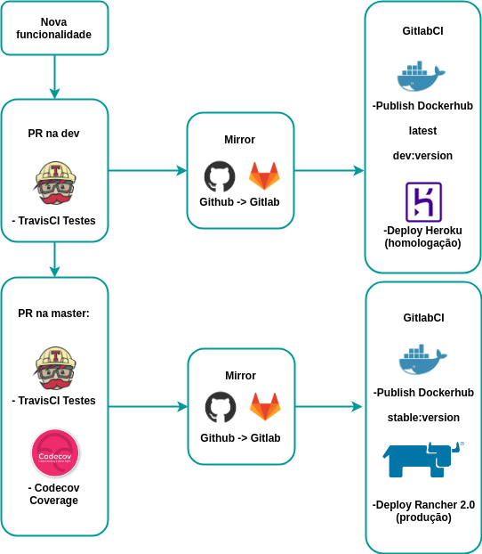

# 1 Introdução

## 1.1 Finalidade

O documento de arquitetura tem o objetivo de especificar decisões arquiteturais relevantes ao projeto Integra, descrevendo seus aspectos e funcionalidades do sistema de forma clara e objetiva, onde serão utilizadas as tecnologias Django REST Framework, JWT, React Native e Expo.

## 1.2 Escopo

Este documento se aplica à produção do aplicativo Integra, implementado para a plataforma *Android*, representando a arquitetura utilizada.

# 2 Representação da Arquitetura

## 2.1 Diagrama de relações

O diagrama apresenta cada etapa que será seguida para que o aplicativo funcione, relacionando o *front-end* com o *back-end*.

## 2.2 Diagrama React/Microsserviços

### React-Native

O React-Native é um *framework* que utiliza o mesmo *design* que o React tendo aplicação na construção de aplicativos *mobile* utilizando apenas *javascript* e traz uma rica interface, a partir de componentes declarativos, para o ambiente *mobile*. O React-Native trás uma propósta rápida e prática para recarregar o aplicativo instantâneamente, sem precisar compilar, com o *"Hot Recoading"*, que tem como objetivo trazer um *feedback* em menos de 1 segundo. Este *framework* combina os componentes escritos em Objective-C, Java, ou Swift, podendo ser escritas parte do aplicativo usando um código nativo [1].

### Microsserviços

Uma arquitetura de *software* baseada em microsserviços consiste em aplicações independentes entre si, em que elas se comunicam através de API's [2], sendo que cada microsserviço possui seu escopo limitado.
Ou seja, um microsserviço é totalmente independente e muito importante no desenvolvimento de um *software*, que geralmente é feito com vários microsserviços, implicando assim em um *software* bem particionado, o que pode vir a facilitar sua manutenção, já que qualquer atualização não seria necessário recompilar o aplicativo inteiro.

Os microsserviços lidam com requisições e respostas HTTP com uma API *GATEWAY*. Eles respondem então com JSON/XML OU HTML enviado para os componentes apresentados [3]. Cada microsserviço possui também seu próprio banco de dados.

A API *GATEWAY*, no contexto atual, intermedia a comunicação entre os microsserviços, é a principal porta de entrada de dados além de realizar a verificação do *token* do usuário. Além disso, a API *GATEWAY* recebe requisições realizadas pelo usuário, processa e as redireciona aos microsserviços relacionados. Então há a resposta para a API *GATEWAY*, redirecionando a resposta ao usuário.

### Cloudinary

CDN (*Content Delivery Network*) é definida como uma rede de servidores que armazenam réplicas do conteúdo de outros locais na memória (cache) e depois os entrega aos visitantes [9], ou seja, é uma rede de distribuição de conteúdo. Uma CDN conhecida é o Cloudinary. No projeto Integra, o Cloudinary tem a função de armazenamento e distribuição de imagens.

## 2.2 Diagrama Django REST Framework

### *Model*

A *model* é a representação dos objetos, permitindo obter informações do banco de dados sem conhecer a complexidade de tal. Essa camada contém tudo sobre os dados: como acessar, validar, comportamentos e relações entre dados [4].

### *View*

A *view* controla o fluxo de informações entre a *model* e o *template*. Essa camada utiliza lógica programada para decidir quais informações serão extraídas do banco de dados e quais serão transmitidas para exibição [5].

### *Serializer*

Os *serializers* permitem que dados complexos sejam convertidos em tipos de dados nativos do python, que podem ser renderizados facilmente em JSON, XML e outros tipos de conteúdo. No Django Rest, os *serializers* funcionam de forma semelhante às classes *Form* e *ModelForm* do Django. A classe *Serializer* fornece uma maneira de controlar a saída de suas respostas, bem como uma classe *ModelSerializer* que fornece um atalho útil para a criação de *serializers* que lidam com instâncias da *model* [6].

### *URL*

O *framework* REST tem suporte para o roteamento automático de URL para o Django, e fornece uma forma simples, rápida e consistente de conectar sua lógica de visualização a um conjunto de URLs. Tem funcionalidade similar a outras estruturas *web* como Rails [7].

### *Test*

O *framework* REST inclui algumas classes auxiliares que herdam a estrutura de teste existente do Django e melhoram o suporte para fazer requisições para a API [8].

# 3 Metas e Restrições de Arquitetura

Para o desenvolvimento deste projeto serão ultilizadas as seguintes tecnologias:

- React-native: Utilizado para a construção do aplicativo em *Android*;
- Python: Versão 3.6 como linguagem base das aplicações *back-end*
- Django: *Framework* para desenvolvimento de aplicações *web* em python
- Django REST Framework: Utilizado para construção de API's e microsserviços;
- RabbitMQ: Barramento de mensagens entre os microsserviços e o aplicativo;
- PostgreSQL: Banco de Dados relacional;
- Cloudinary: Serviço de armazenamento de imagens.

# 4 Visão de Implementação

## 4.1 Diagrama de classes e serviços

## 4.2 Diagrama de Pacotes

### *Front-end*

### *Back-end*

# 5 *Pipeline* de *deploy* dos microsserviços

# 6 Referências bibliográficas

[1] Codificar. O que é React Native? O futuro do desenvolvimento híbrido. Disponível em: <https://codificar.com.br/aplicativos/o-que-e-react-native-o-futuro-desenvolvimento-hibrido/>. Acesso em: 25/11/18.

[2] DevMedia. Microserviços em Java. Disponível em: <https://www.devmedia.com.br/forum/microservicos-em-java/580548>. Acesso em: 25/11/2018.

[3] Matruskan. Uma cartilha rápida sobre microsserviços. Disponível em: <https://matruskan.wordpress.com/2016/05/03/uma-cartilha-rapida-sobre-microsservicos/>. Acesso em: 26/11/18.

[4] Django Girls Tutorial. Modelos do Django. Disponível em: <https://tutorial.djangogirls.org/pt/django_models/>. Acesso em: 25/11/18.

[5] Django Rest Framework. Class-based Views. Disponível em: <https://www.django-rest-framework.org/api-guide/views/>. Acesso em: 25/11/18.

[6] Django Rest Framework. Serializers. Disponível em: <https://www.django-rest-framework.org/api-guide/serializers/>. Acesso em: 25/11/18.

[7] Django Girls Tutorial. URL's. Disponível em: <https://tutorial.djangogirls.org/pt/django_urls/>. Acesso em: 25/11/18.

[8] Django Rest Framework. Testing. Disponível em: <https://www.django-rest-framework.org/api-guide/testing/>. Acesso em: 25/11/18.

[9] GoCache. O que é CDN. Disponível em: <https://www.gocache.com.br/cdn/>. Acesso em: 26/11/18.
