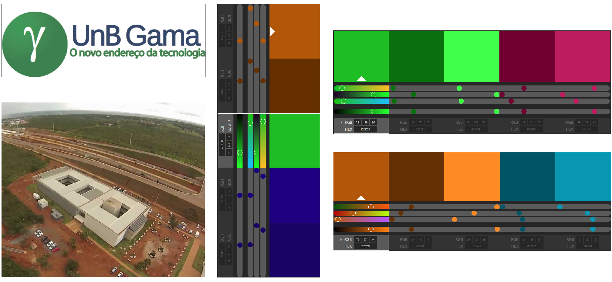
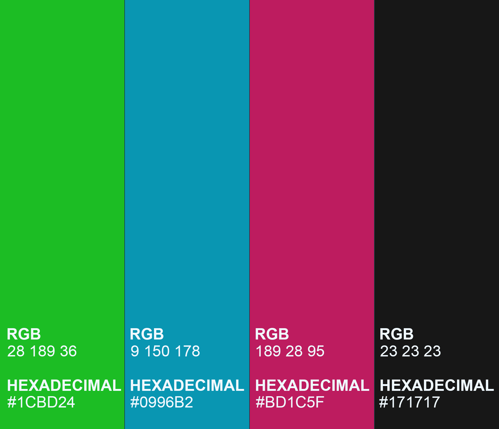
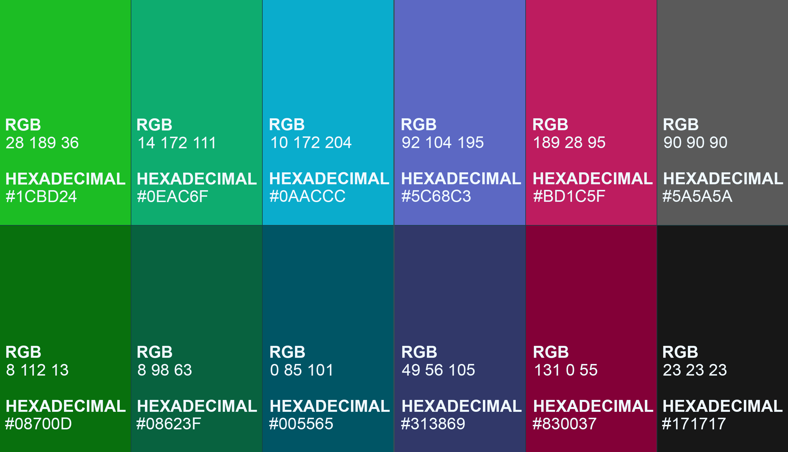

# 1 Introdução
## 1.1 Objetivo do guia
O Guia de identidade visual apresenta convenções para o *design* das telas da aplicação e para sua identidade visual a partir da definição de logomarca do produto, paleta de cores, tipografia e *framework* utilizada na produção do *front-end*. Essas definições têm como objetivo ajudar a uniformizar a experiência do usuário durante o uso da aplicação.

## 1.2 Estratégia de negócio

# 2 Logo
## 2.1 Definição da Logo
## 2.2 Logo e cores

# 3 Paleta de cores
As cores foram definidas a partir da análise da logo da FGA e de fotos aéreas do campus. As cores coletadas foram comparadas junto as suas cores complementares para a criação da paleta primária de cores do aplicativo.

A partir das cores escolhidas foi feito um gradiente entre elas para entender como elas transacionam e a partir da transição foram identificadas as cinco cores que são usadas para definir a identidade de cada funcionalidade. Os ícones de cada funcionalidade são do estilo Material e foram extraídos do banco de ícones Icons8 (https://icons8.com.br/icon/new-icons/material).

Cada ícone ilustrado na imagem acima representa uma funcionalidade diferente do aplicativo, sendo eles respectivamente:
* Verde Lima - Eventos
* Verde Jade - Vendas
* Azul Turquesa - Indicação de locais
* Roxo - Proteção do carro
* Carmesim - Configurações

## 3.1 Paleta
Para verificar a conformidade da paleta de cores foi utilizado como base as cores derivadas das cores bases pelo Adobe Color (https://color.adobe.com/pt/create/color-wheel/). Algumas cores tiveram os valores alterados comparado a paleta de cor inicial para aumentar a saturação.

## 3.2 Identidade das funcionalidades pelas cores

# 4 Tipografia