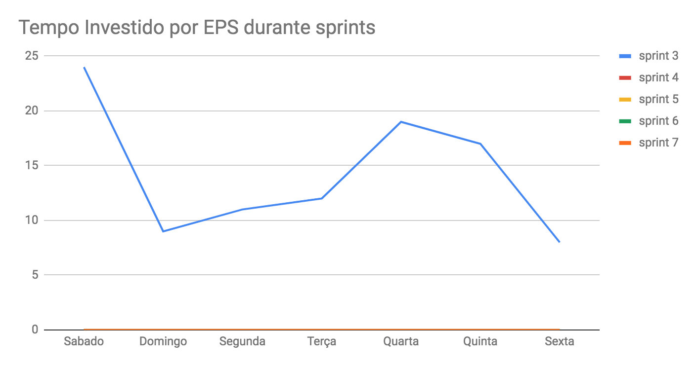
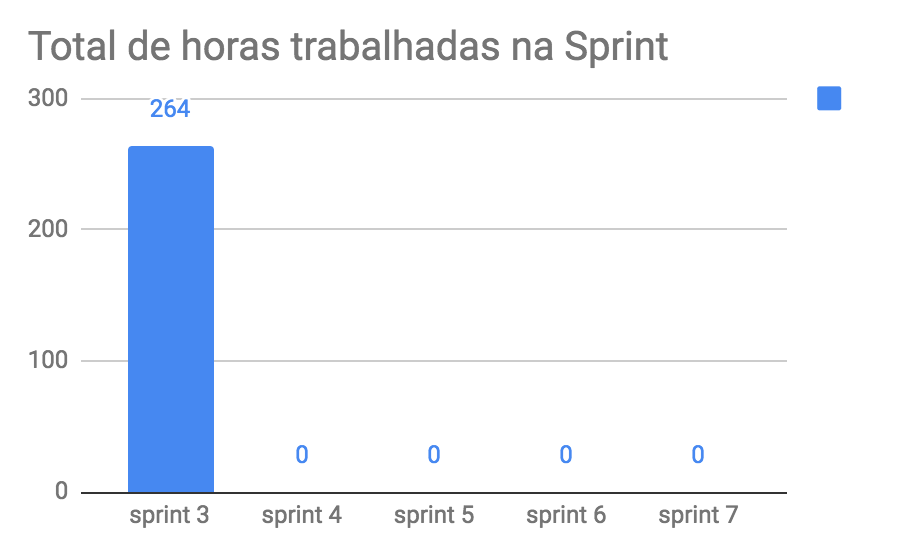

# Planejamento da Sprint
|Par|História|Pontos|
|---|:------:|:----:|
|[André Pinto](https://github.com/orgs/fga-eps-mds/people/andrelucax) e [Welison Almeida](https://github.com/orgs/fga-eps-mds/people/WelisonR)|US04 e US07|29|
|[Gustavo Lima](https://github.com/orgs/fga-eps-mds/people/gustavolima00) e [Dâmaso Pereira](https://github.com/orgs/fga-eps-mds/people/juniopereirab)|US08 e US10|29|
|[Shayane Alcântara](https://github.com/orgs/fga-eps-mds/people/shayanealcantara) e [Leonardo Medeiros](https://github.com/orgs/fga-eps-mds/people/leomedeiros1)|US01 e US02|16|

-------------------------------------------------------------------------------
# Riscos
## Riscos Internos
|Risco interno|Medidas|Pontuação|
|:------------|:------|:-------:|
|Dificuldade de integração dos micro-serviços entre os projetos|<ul> <li>Fazer o mock dos microsserviços para não interferir no desenvolvimento do atual;</li> <li>Tomar a responsabilidade de desenvolver o microsserviço de cadastro.</li> </ul>|55|
|Dificuldade de desenvolvimento do front-end com várias equipes|<ul> <li>Produzir guia de identidade visual;</li> <li>Definir divisão de seções do aplicativo para cada projeto.</li> </ul>|55|
|Falta de conhecimento da equipe de desenvolvimento sobre as tecnologias|<ul> <li>Aula de consumo de uma API por REACT</li> <li>Aula de JWT</li> <li>Treinamento de pytest</li> <li>Treinamento de REACT Native</li> </ul>|34|
|Problema de comunicação|<ul> <li>Definir canais de comunicação entre as equipes do app;</li> <li>Definir canais de comunição para a nossa equipe;</li> <li>Documentar as dailies em um canal do Discord para manter a frêquencia certa.</li> </ul>|13|
|Membro faltante nas reuniões|<ul> <li>Sempre lembrar a equipe pelo Telegram todas as reuniões presenciais;</li> <li>O membro que tiver que se ausentar de alguma reunião deve avisar com antecedência pelo grupo do Telegram.</li> </ul>|1|
|Abandono da disciplina por membro da equipe| |5|
|Defeito no equipamento|<ul> <li>Emprestar equipamento para o membro da equipe prujudicado;</li> <li>Usar programação em pares.</li> </ul>|13|
|Membro desestimulado|<ul> <li>Manter comunicação constante entre os membros para estar sempre auxiliando os membros nas dificuladades.</li> </ul>|1|
|Conhecimento desnivelado|<ul> <li>Usar pareamento para ajudar os membros da equipe a compartilharem o conhecimento;</li> <li>Srum Master distribuir os pares de maneira inteligente para que o compartilhamento de conhecimento seja o mais efetivo possível.</li> </ul>|21|
|Falta de clareza no escopo do produto|<ul> <li>Gerar documento de visão;</li> <li>Gerar TAP;</li> <li>Seguir modelo de histórias de usuário e descrever critérios de aceitação bem definidos.</li> </ul>|13|
|Falha na coleta de métricas|<ul> <li>Treinamento de Scrum;</li> <li>Automatização na coleta de métricas sempre que possível.</li> </ul>|8|

## Riscos Externos
|Risco externo|Medidas|Pontuação|
|:------------|:------|:-------:|
|Produto não atende a necessidade do cliente|<ul> <li>Apresentar o produto para o cliente em toda sprint que tiver entrega de valor;</li> <li>Testar usabilidade do produto com o cliente frequentemente.</li> </ul>|34|
|Mudança abrupta do escopo| |5|

-------------------------------------------------------------------------------
# Retrospectiva da Sprint
## Pontos positivos
1. Apoio de Devops com o Docker;
2. Comunicações entre os membros da equipe;
3. Ajuda dos integrantes de EPS;
4. Toda q equipe é proativa e participativa;
5. Ambiente de desenvolvimento estável;
6. A equipe de desenvolvimento ganhou muito conhecimento no desenvolvimento do projeto;
7. Alguns membros da equipe de desenvolvimento gostaram de programar com pares;
8. Sinergia entre os membros da equipe.

## Pontos de melhoria
1. A configuração dos ambientes de desenvolvimento estão lentas;
2. Atraso no preenchimento da *daily*;
3. Dificuldade de realizar testes no código por falta de conhecimento;
4. Alguns membros da equipe de desenvolvimento não gostaram de fazer programação em pares, pois eles se sentem mais produtivos trabalhando sozinhos.

## Medidas a serem tomadas
1. Concentrar priorizar a configuração de ambientes de desenvolvimento que afetam diretamente o trabalho de desenvolvimento proposto na sprint;
2. Lembrar diariamente sobre as *dailies*;
3. Fazer aula de testes unitários em Django;
4. Organizar os pares para deixar os membros mais confortáveis ao fazer pareamento.

## Melhorias
1. Os horários das reuniões foram respeitados;
2. Tema bem defino e claro para todos os membros da equipe;
3. Entendimento melhor da cominicação da API com o *front-end*;
4. Reuniões ficaram o o objetivo mais claro, mas ainda há perda de tempo no decorrer da reunião.

-------------------------------------------------------------------------------
# Métricas
## Horas durante a sprint

## Horas totais

## Velocity

## Burndown